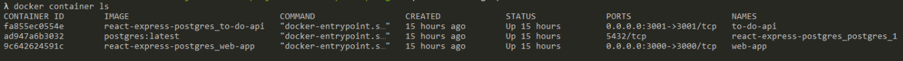
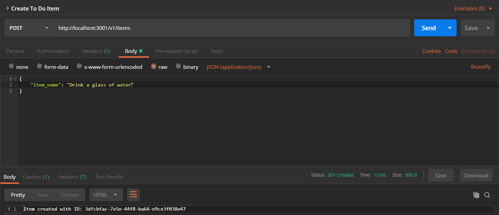
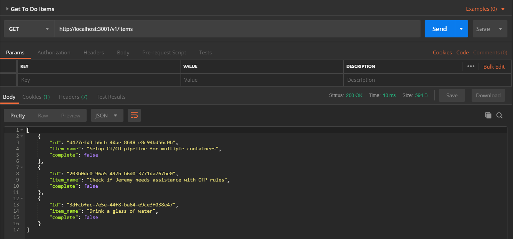
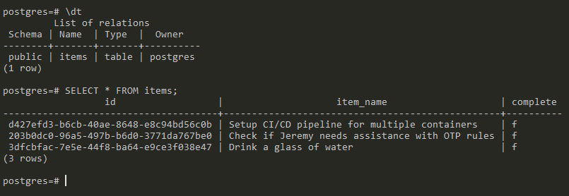
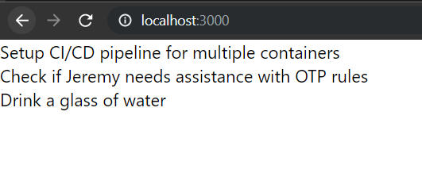

## To Do App
It creates the to do list.
*I Created this multi-container application which has a client (React), a server (Node.js)and a database instance (Postgres).*

## How To Run
1. To get the containers up and running
```
$ docker-compose up -d
```

2. To check the running containers
```
$ docker container ls
```


3. Now, we create some to do items using Postman. 

 ```
 Running the GET request to:
 http://localhost:3001/v1/items
 ```


4. To get a bash shell in the container.
 ```
 docker exec -it ad947a6b302 bash
 ```
 
5. To connect to the postgres database with the default credentials
 ```
psql -U postgres
```


6. Testing client application


##Ultimate Hierrachy
├── client
├── server
├── img
├── Readme.md
└── docker-compose.yml
